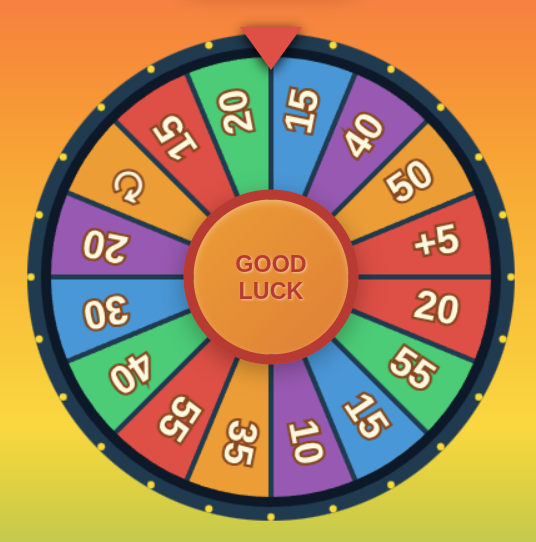

# Spin & Win

Spin & Win is a simple wheel-of-fortune style game. Spin the wheel to earn minutes and collect bonuses!

## How to Play

1. Select the number of spins, the maximum minutes on the wheel and a background on the setup screen.
2. Press **Start** to move to the wheel.
3. Hold the **GOOD LUCK** button to build spin power and release to spin.
4. The wheel can land on minute values, extra spins (`\u21bb`) or a `+5` bonus.
5. Tap the minutes display to lock or unlock your score between spins.
6. After your spins are finished you'll see the total minutes you've won.

## Starting the Application

* You can open the game in your Web browser (`www/index.html`).
* You can upload the game to your Web server (only the `www` folder).

## Running on LAN

The Makefile provides two convenience commands for running the game with Docker Compose:

- `make up` starts a small nginx container that serves the contents of the `www/` folder on [http://localhost:8000](http://localhost:8000).
- `make down` stops the container when you're done playing.

