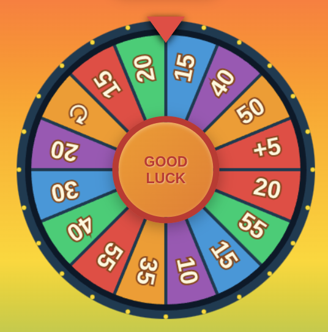

# Spin & Win

Spin & Win is a simple wheel-of-fortune style game. Spin the wheel to earn minutes and collect bonuses!

## How to Play

1. Select the number of spins, the maximum minutes on the wheel and a theme on the setup screen: Classic (with a choice of backgrounds), Candy Pop, Galaxy Night, Holo Dream or Cat Café.
2. Press **Start** to move to the wheel.
3. Hold the **GOOD LUCK** button to build spin power and release to spin.
4. The wheel can land on minute values, extra spins (`↻`) or a `+5` bonus.
5. Tap the minutes display to lock or unlock your score between spins.
6. After your spins are finished, you'll reach the Gamble Screen where you can keep your won minutes safely or flip the lucky coin: heads adds 50% more, tails leaves you with 10 minutes.
7. Finally, you'll see the End Screen with your total minutes on a medal, the result of every spin (the one that counts is highlighted) and a bar showing where your minutes came from. Press **Play again** to start a new round with the same settings, or **Settings** to change them.

## Starting the Application

* You can open the game in your Web browser (`www/index.html`).
* You can upload the game to your Web server (only the `www` folder).
* Yoo can check out the demo: [lucky.najberg.pl](http://lucky.najberg.pl)

## Running on LAN

The Makefile provides two convenience commands for running the game with Docker Compose:

- `make up` starts a small nginx container that serves the contents of the `www/` folder on [http://localhost:8000](http://localhost:8000).
- `make down` stops the container when you're done playing.

## Deploying

`make deploy` uploads the game files from `www/` to the FTP server (by default `ftp.cluster027.hosting.ovh.net/lucky/`). curl asks for the FTP password. You can override the target with `FTP_USER=... FTP_URL=... make deploy`.
